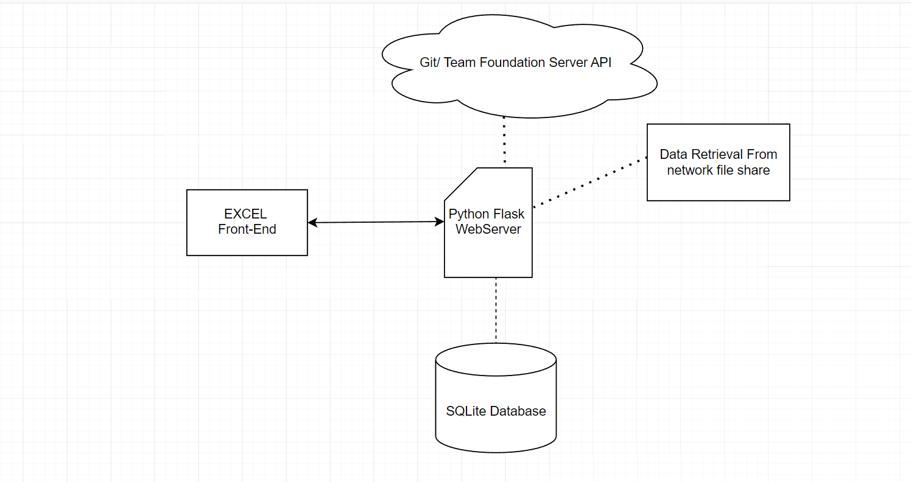

# Excel_Service_Tracker_Webserver
<h1>Software Project:  Excel Front-End retrieves data from python flask webserver</h1>

<h1>Application Diagram</h1>

<h2>TOOLS USED: Excel with VBA, Python, Flask web framework, Pandas, multithreading.pool</h2>
 <h2>USE CASE: Tracks the development status of thousands of micro-services.  Engineers update the status using the excel front-end.  Data is automatically updated using data retrieved from git/TFS code repositores</h2> 

 
<h2>MAIN FEATURES: +Generates reports to visualize overall development progress; Utilized by upper management +Updates data automatically (no user action required) +Saves data in outside database (SQLite) +Color-Codes messages based off of custom criteria 
  

